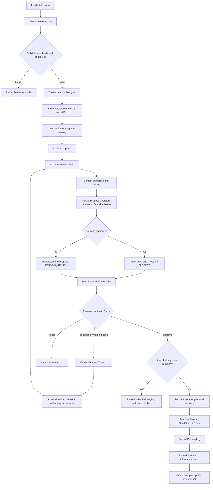
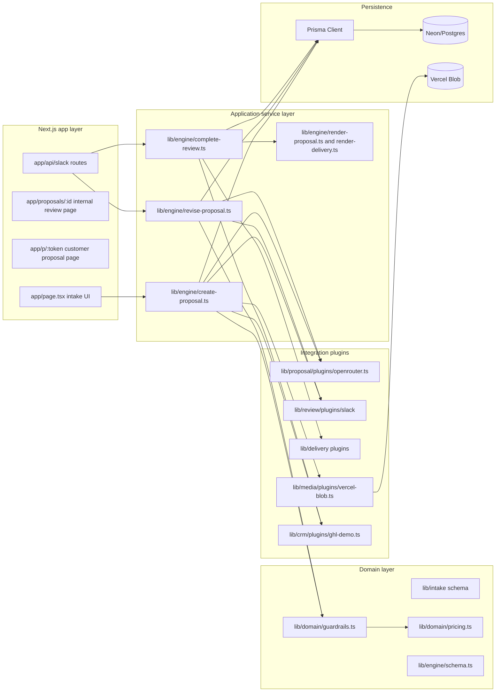
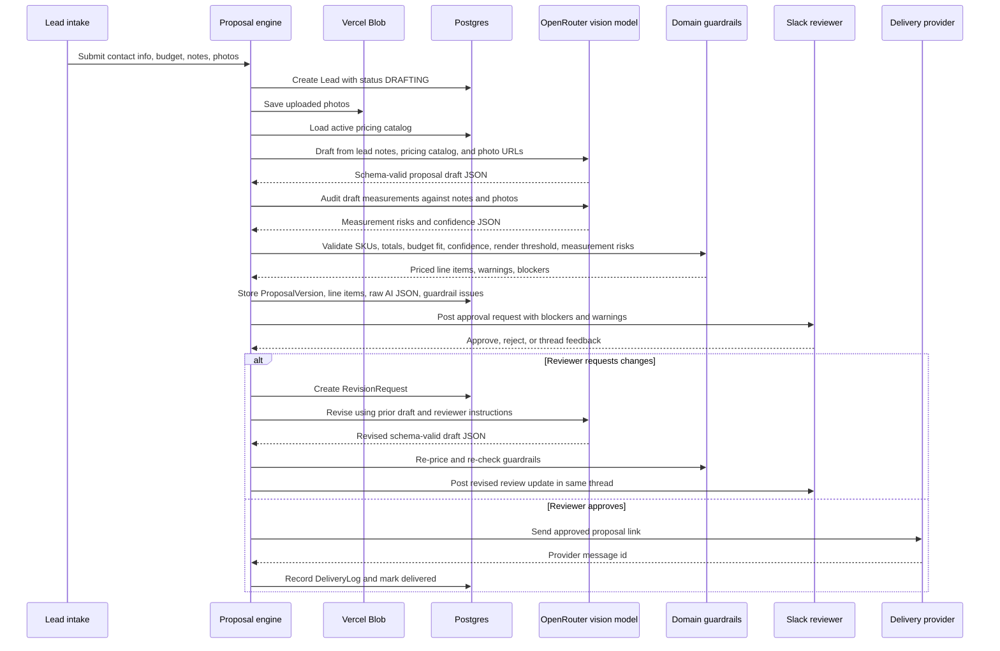

# Greenscape Pro Proposal Builder

AI-assisted proposal workflow for Greenscape Pro. The app turns lead intake notes and site photos into a priced proposal draft, routes it to Slack for human approval, and sends the approved proposal through the configured delivery provider.

## Application flow



## Service-level architecture



### Service responsibilities

| Service level | Files | Responsibility |
| --- | --- | --- |
| App layer | `app/*`, `components/*` | Collect lead data, display proposal state, receive Slack events and actions. |
| Engine layer | `lib/engine/*` | Orchestrate proposal creation, revision, approval, delivery, and persistence. |
| Domain layer | `lib/domain/*`, `lib/intake/*`, `lib/engine/schema.ts` | Validate inputs, calculate catalog pricing, enforce business guardrails, and parse AI output. |
| AI service | `lib/proposal/plugins/openrouter.ts` | Calls OpenRouter vision-capable chat models for drafting, revision, and measurement QA. |
| Review service | `lib/review/plugins/slack/*` | Posts Slack approval cards, handles threaded revision flow, and records reviewer decisions. |
| Delivery service | `lib/delivery/plugins/*` | Sends approved proposals through Resend, SendGrid, or Slack and returns provider message IDs. |
| Persistence | `lib/db.ts`, `prisma/schema.prisma` | Stores leads, photos, pricing catalog items, proposals, versions, guardrails, reviews, revisions, delivery logs, and integration events. |

## AI proposal flow



### What the AI does

The app uses OpenRouter chat completions with image URLs, strict JSON-schema responses, and Zod parsing. Initial proposal creation makes two AI calls:

1. **Proposal draft call**
   - Input: lead contact fields, project type, notes, budget range, uploaded photo URLs, and active pricing catalog SKUs.
   - Output: executive summary, customer message, selected SKUs, quantities, quantity sources, line confidence, assumptions, unknowns, render brief, and draft confidence.
   - Constraint: the model can only choose existing catalog SKUs. It does not calculate prices or totals.

2. **Measurement audit call**
   - Input: the same lead context, photo URLs, catalog units, and draft line items.
   - Output: measurement warnings or blockers for missing scale references, unit mismatch risk, unsupported quantities, and quantity disagreement.
   - Constraint: the model audits measurement support only. It does not approve delivery.

Revision uses a third AI path: Slack thread feedback plus the previous draft go back to the model. The revised draft then runs through the same measurement audit and guardrail pipeline before a reviewer can approve it.

### Guardrails after AI output

The app treats AI output as a draft, not the source of truth.

- Zod schemas reject malformed model JSON.
- The domain layer rejects unknown SKUs.
- The app calculates line totals from `PricingItem.unitPriceCents` instead of trusting the model.
- Proposals below $8,000 or above $120,000 get blocking issues.
- Draft and line confidence below `0.7` trigger blocking or warning issues.
- Projects over $30,000 trigger a render-required warning.
- The measurement audit can block photo-only estimates with no scale reference.
- Slack approval still checks for blocking guardrails before delivery.

## Persistence model

Core tables in `prisma/schema.prisma`:

- `Lead`: customer and project intake data.
- `Photo`: uploaded image metadata and Blob URLs.
- `PricingItem`: active catalog SKUs and unit pricing.
- `Proposal`: current proposal status and public token.
- `ProposalVersion`: versioned AI draft, prompt version, model label, raw model JSON, total, and confidence.
- `ProposalLineItem`: priced catalog lines derived from the AI draft.
- `GuardrailIssue`: warning and blocking issues for each proposal version.
- `ProposalReview`: Slack review thread and decision state.
- `RevisionRequest`: reviewer feedback that triggers an AI revision.
- `DeliveryLog`: outbound proposal delivery attempts and provider message IDs.
- `IntegrationEvent`: stored webhook or integration event payloads.

## External integrations

| Integration | Purpose | Environment variables |
| --- | --- | --- |
| OpenRouter | Vision-capable AI proposal drafting and measurement audit | `OPENROUTER_API_KEY`, `OPENROUTER_MODEL`, `OPENROUTER_FALLBACK_MODEL`, `OPENROUTER_SITE_URL`, `OPENROUTER_APP_NAME` |
| Slack | Human approval, rejection, and threaded revision feedback | `SLACK_BOT_TOKEN`, `SLACK_SIGNING_SECRET`, `SLACK_REVIEW_CHANNEL_ID`, `SLACK_DELIVERY_CHANNEL_ID` |
| Resend | Default customer email delivery | `RESEND_API_KEY`, `RESEND_FROM` |
| SendGrid | Optional customer email delivery | `SENDGRID_API_KEY`, `SENDGRID_FROM` |
| Vercel Blob | Lead photo storage for AI vision calls | `BLOB_READ_WRITE_TOKEN` |
| Neon/Postgres | Persistent application database | `DATABASE_URL`, `DIRECT_URL` |

## Local development

```bash
pnpm install
pnpm db:generate
pnpm db:migrate
pnpm db:seed
pnpm dev
```

Run checks before shipping:

```bash
pnpm lint
pnpm typecheck
pnpm test:transient
```

See `.env.example` for required configuration.
